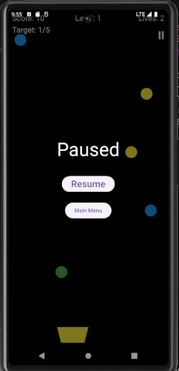

# Ball Collector Game

A fun and addictive mobile game built with Flutter and the Flame engine. Collect falling balls of the correct color into your bucket, level up, and chase the high score!

## Prerequisites

-   Flutter SDK (v3.x.x recommended - check your Flame version compatibility)
-   Dart SDK (comes with Flutter)
-   An IDE like Android Studio or VS Code with Flutter & Dart plugins.
-   An Android Emulator/iOS Simulator, or a physical device for testing.

## Project Github Link

https://github.com/Geek-ubaid/ball-collect-game

## Key Features

-   **Engaging Gameplay:** Catch falling balls that match your bucket's target color.
-   **Dynamic Bucket Color:** The target bucket color changes after every successful collection.
-   **Scoring System:** Increase your score by collecting correct balls.
-   **Level Progression:** Advance through levels by collecting a fixed number of correct balls.
-   **Increasing Difficulty:** Ball speed and spawn rates adjust with each level.
-   **Color Variance Control:** The variety of falling ball colors changes with levels to adjust difficulty.
-   **Lives System:** Lose lives for missing correct balls or collecting wrong ones.
-   **High Score:** Your best score is saved locally on the device.
-   **Intuitive Controls:** Drag anywhere in the lower screen area to move the bucket.
-   **Multiple Screens:** Main menu and game screen with overlays for pause and game over.

## Modules & Components

### `lib/game/ball_collector_game.dart`
-   The core `FlameGame` class orchestrating the game loop, state, and component management.
-   Handles game logic such as scoring, lives, levels, ball spawning, and collision responses.
-   Manages game state (menu, playing, paused, game over).

### `lib/game/components/`
-   **`ball_component.dart`**: Represents a falling ball with color, glow effect, and movement.
-   **`bucket_component.dart`**: Represents the player-controlled bucket, using a sprite image.
-   **`hud_component.dart`**: Displays game information like Score, Lives, Level, and Target.

### `lib/game/utils/`
-   **`game_colors.dart`**: Defines the color palette for balls and utility functions for random color selection.
-   **`highscore_manager.dart`**: Handles saving and retrieving the high score using `shared_preferences`.

### `lib/overlays/`
-   Flutter widgets displayed on top of the Flame game canvas.
-   **`main_menu_overlay.dart`**: The initial screen with "Start Game" and High Score display.
-   **`game_over_overlay.dart`**: Shown when the player runs out of lives, displaying final score and options.
-   **`pause_overlay.dart`**: Allows pausing and resuming the game.

## Getting Started

1.  **Clone the repository:**
    ```bash
    git clone https://github.com/Geek-ubaid/ball-collect-game.git
    cd ball_collector_game
    ```

2.  **Ensure Flutter is set up:**
    Follow the official Flutter installation guide: [https://flutter.dev/docs/get-started/install](https://flutter.dev/docs/get-started/install)

3.  **Get dependencies:**
    ```bash
    flutter pub get
    ```

4.  **Run the game:**
    ```bash
    flutter run
    ```
    -   Connect a device or start an emulator/simulator.
    -   The app will build and install.

## Development Scripts (Standard Flutter Commands)

-   `flutter run`: Run the app in debug mode.
-   `flutter run --release`: Build and run the app in release mode.
-   `flutter build apk`: Build an Android APK.
-   `flutter build ios`: Build an iOS app bundle.
-   `flutter analyze`: Analyze the project's Dart code for errors and warnings.
-   `flutter test`: Run automated tests.

## Configuration

-   **`pubspec.yaml`**:
    -   Manage Flutter SDK constraints.
    -   Add and version dependencies (e.g., `flame`, `shared_preferences`).
    -   Declare assets like images (e.g., `assets/images/bucket.png`).
-   **`lib/game/ball_collector_game.dart`**:
    -   Adjust game parameters like initial ball speed, spawn rates, level targets, color chances, etc.
-   **Asset files**:
    -   Modify images in `assets/images/` to change visual appearance.

## Dependencies

-   **Flutter SDK**: For the core framework and UI.
-   **Flame Engine (`flame`)**: For game loop, component system, collision detection, sprite handling, and effects.
-   **Shared Preferences (`shared_preferences`)**: For local high score storage.

## Screenshots/Gameplay Preview

| Screen                 | Web Preview                                         | Android Preview                                                 |
|------------------------|-----------------------------------------------------|-----------------------------------------------------------------|
| Main Menu              |     |     |
| Gameplay               |     |     |
| Game Over Screen       |    |  |
